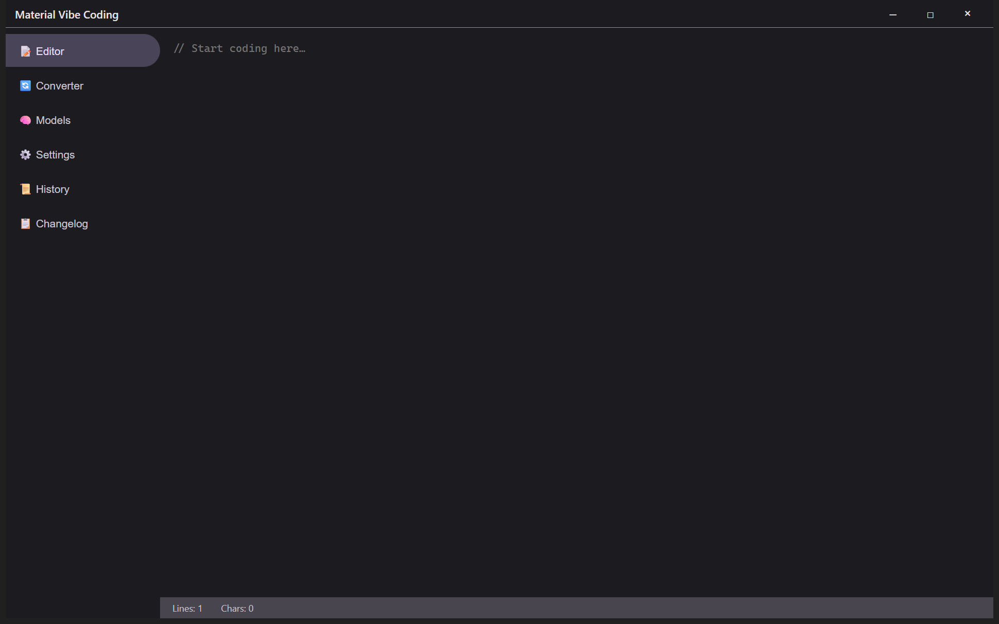
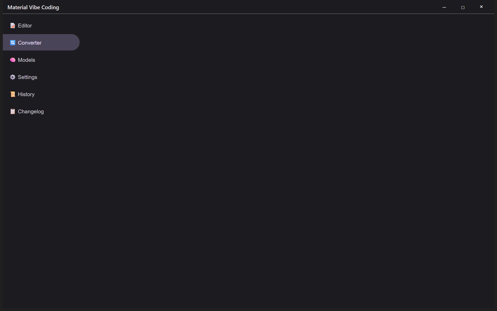
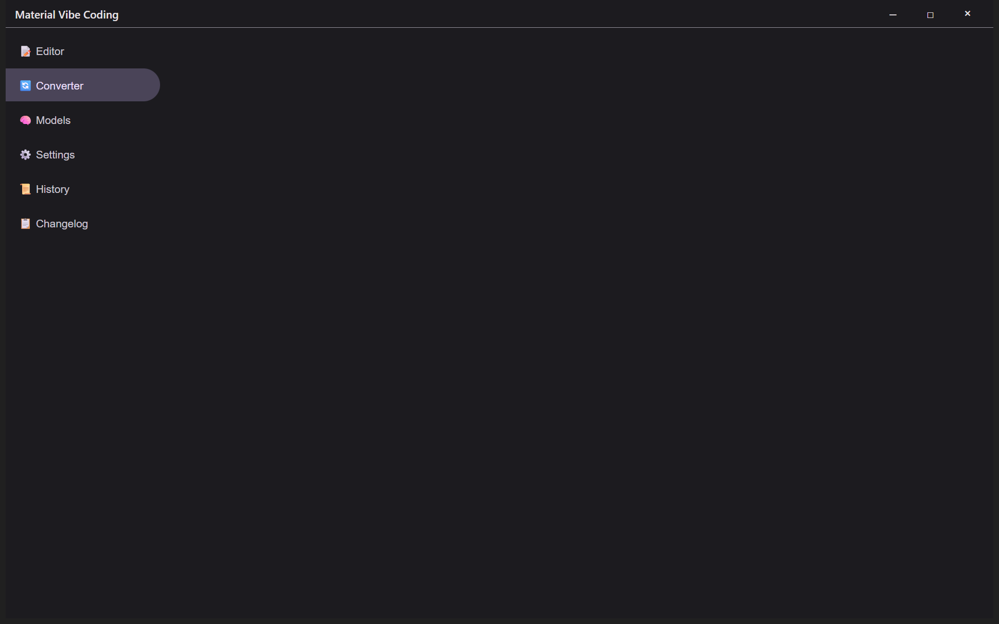
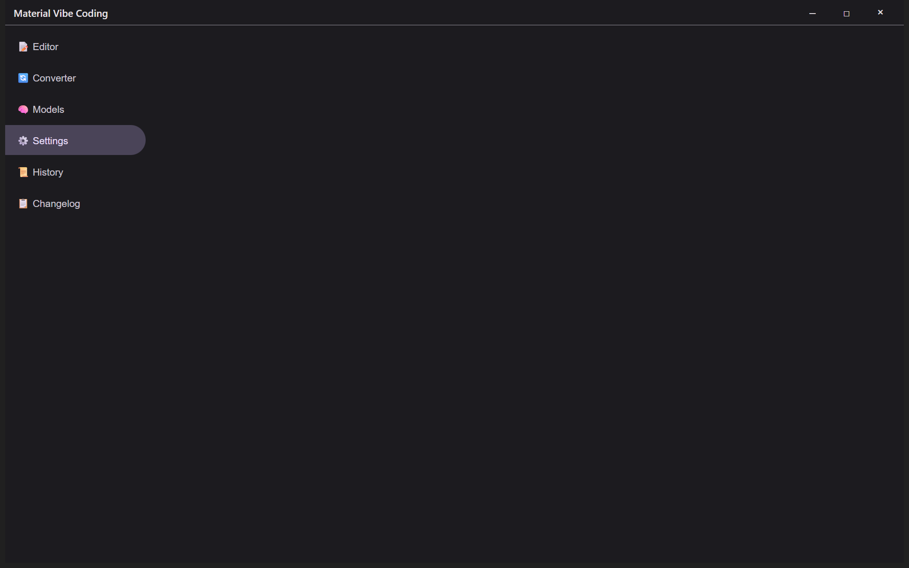
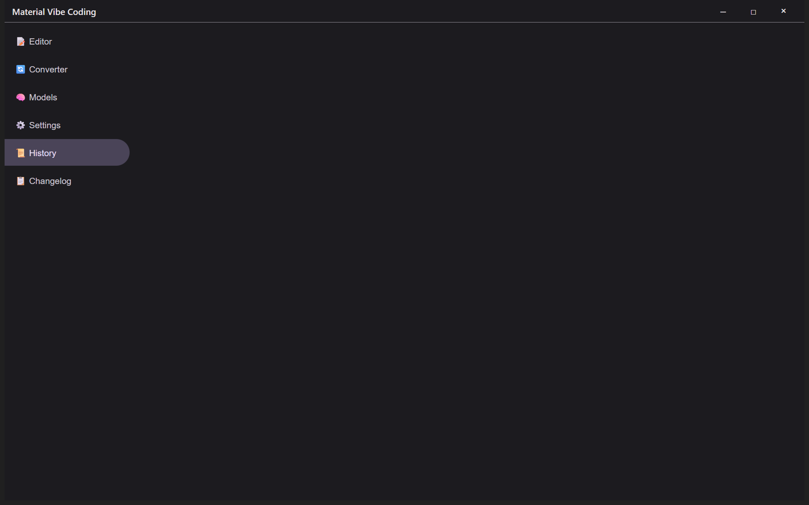
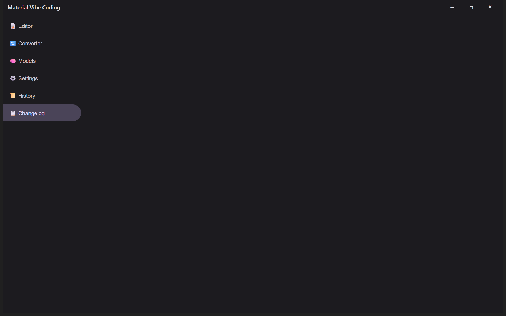

# Material Vibe Coding

A Material Design 3 vibe coding studio for Windows, built on Electron Forge with genuine Squirrel.Windows packaging and permanent no-signing policy.

## Features

- Frameless Material Design 3 dark/light theme window with custom title bar
- Browser-style vertical tab navigation (left-docked by default)
- Code editor with live line/char counts
- Command palette (`Ctrl+Shift+F`)
- Non-blocking notification system
- Dim sum surprise (10% at startup)
- Converter catalog surface
- Local Ollama model manager surface
- Settings, history, and changelog surfaces

## Quick start

```bat
build.bat
```

This installs dependencies and builds the runnable Electron app into `out/`.

To build the Windows Squirrel.Windows installer:

```bat
build-installer.bat
```

Both scripts are idempotent, silent-capable (`/s`), and never require code signing. The resulting installer is unsigned and may trigger an unknown-publisher or SmartScreen warning — this is expected under the permanent no-signing policy.

## Repository structure

```
src/
  main.js           Electron main process
  preload.js        Secure context bridge
  renderer/         UI layer (HTML, CSS, JS)
forge.config.js     Electron Forge packaging configuration
.github/workflows/ GitHub Actions release workflow
build.bat           One-click dependency install + build
build-installer.bat One-click Squirrel.Windows installer build
site/              Landing page and documentation site source
```

## HuiShots (real captures from the built artifact)

All captures below are taken from the real built Electron app running on a headless Windows desktop at commit `6933034`, using the cheap Lowlevel MCP route. No mocks, no source-tree screenshots.

### Editor



*Main editor panel showing the code textarea, status bar with line/char counts, left-docked vertical tab strip, and the custom dark title bar with minimize/maximize/close controls.*

### Converter



*Converter panel showing the drag-and-drop zone with Browse button, the categorized adapter grid covering all eight required categories, and the format search bar with regex builder affordance.*

### Models (Ollama)



*Models panel showing the Ollama status card ("Checking local Ollama service…" with Refresh button) and the model search field with regex builder. When no Ollama instance is running locally, the status honestly reports that state rather than showing fake models.*

### Settings



*Settings panel showing theme selector, language mode dropdown (English / Cantonese / Bilingual), independent per-language funny-level sliders defaulting to 5, narrator toggle, local personal-vocabulary JSON upload control, and School mode switch.*

### History



*History panel showing the honest empty state: "No history entries yet. Changes will appear here as you work." This is the correct starting state — no fake sample documents or mock entries.*

### Changelog



*Changelog panel showing the v1.0.0 release entry describing the first public version of the application.*
